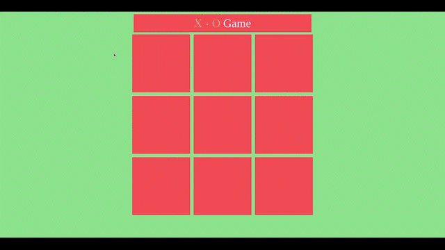

# X - O

Simple X - O game built using HTML, CSS, and JavaScript.


## Run on Terminal

```
google-chrome index.html
```


## Introduction :




### Rules :

- Two players take turns: placing 'X' and 'O' marks in empty spaces on a 3x3 square grid.
- The first player to place 3 marks in a vertical, horizontal, or diagonal row wins the game.
- If all spaces are filled, the game ends in a draw.
